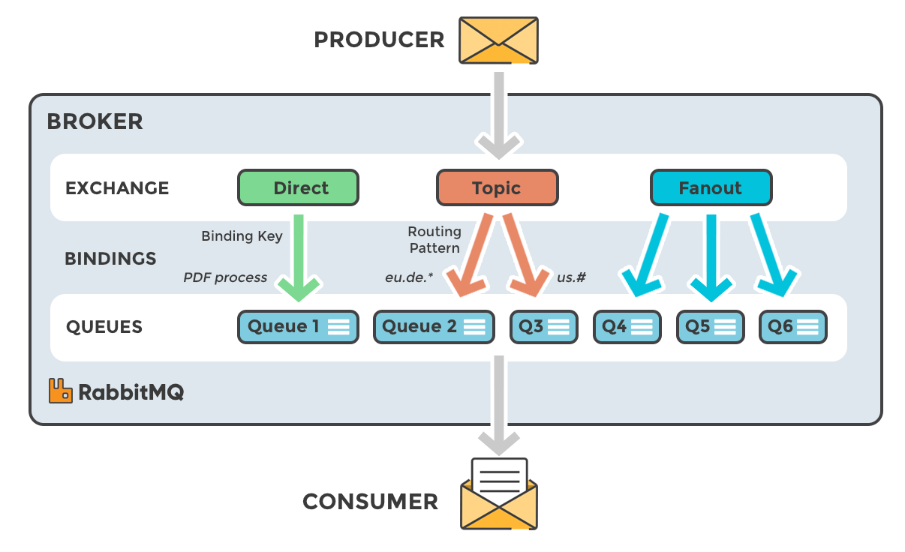
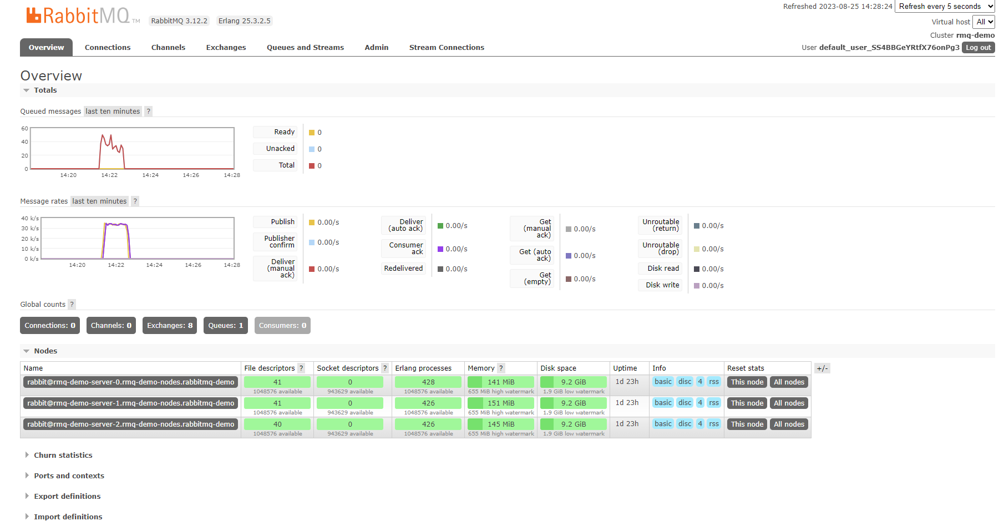
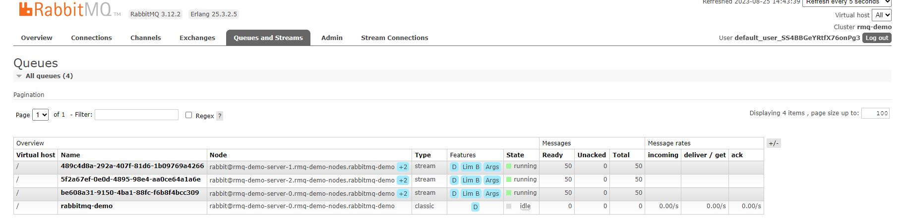

# RabbitMQ Operator Demo
We are going to try a simple RabbitMQ cluster created using RabbitMQ operator. Once the cluster is up, will use the `go` producer to publish some messages.
We will later consume those messages using the consumers.


# Prerequsites
1. Expect that you already have a working kubernetes cluster with the needed permissions to run everything.
2. Go must be installed

## Install RabbitMQ Cluster Operator
```
kubectl apply -f "https://github.com/rabbitmq/cluster-operator/releases/latest/download/cluster-operator.yml"

```
For more details refer the official documentation here https://www.rabbitmq.com/kubernetes/operator/quickstart-operator.html

1. Create a RabbitMQ Cluster using the Operator with Streams enabled.
```
kubectl apply -f rmq.yaml

kubectl get po # run this to check the status of the pods

k get rabbitmqclusters ## also try this
NAME       ALLREPLICASREADY   RECONCILESUCCESS   AGE
rmq-demo   True               True               2d2h
```
Wait for a few minutes for the pod to be up. 
By default a 10GB `PVC` will be created for each pod. 

Set the below env variables
```
export username="$(kubectl get secret rmq-demo-default-user -o jsonpath='{.data.username}' | base64 --decode)"
export password="$(kubectl get secret rmq-demo-default-user -o jsonpath='{.data.password}' | base64 --decode)"
export rmqLBIP=$(k get svc rmq-demo -o jsonpath='{.status.loadBalancer.ingress[].ip}')
## export rmqLBIP=$(k get svc rmq-demo -o jsonpath='{.status.clusterIP}') ## if clusterIP user this
export RMQ_SERVER_URL="amqp://${username}:${password}@${rmqLBIP}:5672/" 


```
These variables will be used in the `go` code below, without the variables it's not going to work.


We are exposing the service as a LoadBalancer, if its not suppored on your cluster, you can always leave it as default(ClusterIP). You can portforward `5672` to local to check the RabbitMQ web UI

To verify the connection, you can connect to the API or the Web UI
```
# Get the complete configs of the current cluster
curl -s -u${username}:${password} ${rmqLBIP}:15672/api/overview | jq
```

Before going to publish the messages, take a look at the below image to understand what's going to happen.



2. Run the Producer app:
```
go run producer.go
```
It will wait for user input from console. Press `enter` when you want to send a message and print `exit` for graceful shutting down.

3. Run the Consumer app:
```
cd consumer1
go run .

cd consumer2
go run .
```
It will connect to the RabbitMQ queue and print all the messages awaiting; each consumer also imitates some work going on by sleeping for 10 seconds after receiving each message. The RabbitMQ acknowledgement is done manually by marking `d.Ack(false)` after every message processing. For eg; you can insert the data to a database and based on the commit message from the DB you could sent the `ack` to RabbitMQ. 
Consumer1 also receives no more than 2 messages at once, Consumer2 - no more than 1


4. Let us do a perf test of the RabbitMQ 
```
kubectl run perf-test --image=pivotalrabbitmq/perf-test -- --uri amqp://${username}:${password}@${rmqLBIP}
```

To check the logs of perf test 
```
kubectl logs -f pod/perf-test
```

The result would look like below,
```
id: test-212122-337, time 16.002 s, sent: 33781 msg/s, received: 33157 msg/s, min/median/75th/95th/99th consumer latency: 349930/445166/477882/517244/533476 µs
id: test-212122-337, time 17.001 s, sent: 30382 msg/s, received: 33261 msg/s, min/median/75th/95th/99th consumer latency: 365384/457736/491200/521051/537919 µs
id: test-212122-337, time 18.001 s, sent: 37455 msg/s, received: 34846 msg/s, min/median/75th/95th/99th consumer latency: 322012/409279/438931/473032/491373 µs
```
You can see that its producing and consuming `~35k msg/s`. This may vary based on your setup. Also take a look at the UI to see the graph.



Let's kill the pod we used for perf test,
```
kubectl delete  pod/perf-test
pod "perf-test" deleted
```

More examples here on how to send a json payload to Rabbitmq - https://github.com/govindkailas/curl_RMQ_post

5. Now if you are interested in the RabbitMQ Streams, try the below,
We will utilise the same RabbitMQ cluster to create few streams and publish 50 messages. There is also a consumers which would immediatly consume the messages.

```
go run streams.go
```




Referances and credits to the below,
- https://www.rabbitmq.com/tutorials/tutorial-one-go.html
- https://github.com/rabbitmq/rabbitmq-stream-go-client
- https://github.com/koterin/broker
- https://www.cloudamqp.com/blog/part1-rabbitmq-for-beginners-what-is-rabbitmq.html